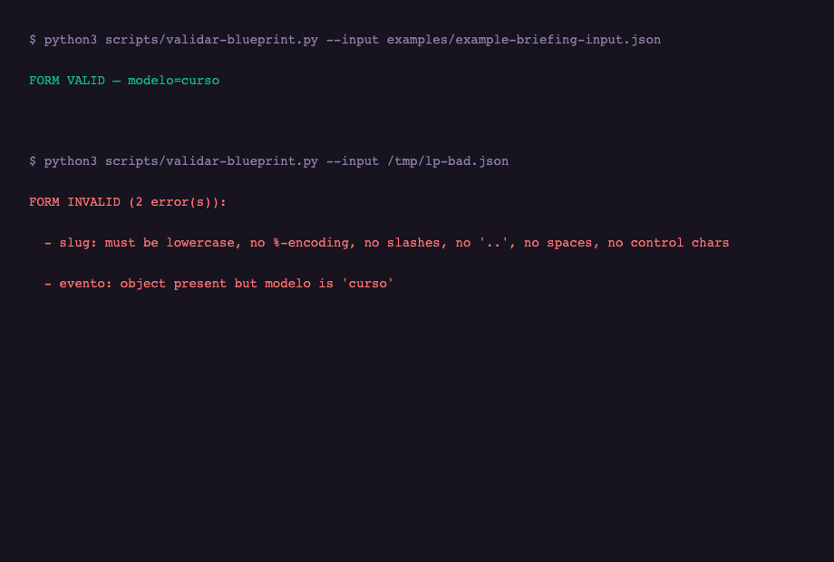

<p align="center">
  
</p>

<p align="center">
  
</p>

<h1 align="center">My_LP_Makes_Neil_Proud</h1>

<p align="center">
  <strong>The landing-page engine that ships evidence-backed pages, not decorated templates.</strong><br>
  A portable, deterministic LP system for Claude Code and Codex — brief, create, edit by command, audit and publish as one auditable cycle.
</p>

<p align="center">
  <a href="./LICENSE"></a>
  
  
  
  
  
</p>


<p align="center">
  <video src="assets/demo.mp4" autoplay muted loop playsinline width="640"></video><br>
  <sub>The engine, animated — five sections assembling into one landing page</sub>
</p>

> **Independent project:** My_LP_Makes_Neil_Proud is not affiliated with, endorsed by, or sponsored by Neil Patel, NP Digital, or their companies. It implements established direct-response publishing patterns — never third-party copy, trademarks, or claims.

---

## Table of contents

- [Em 30 segundos](#em-30-segundos)
- [Para quem é este produto?](#para-quem-é-este-produto)
- [Instalação](#instalação)
- [Início rápido](#início-rápido)
- [Comandos](#comandos)
- [Características](#características)
- [Os seis modelos, em profundidade](#os-seis-modelos-em-profundidade)
- [Os quatro gates, em profundidade](#os-quatro-gates-em-profundidade)
- [A auditoria, critério por critério](#a-auditoria-critério-por-critério)
- [Extração de URL e briefing, em profundidade](#extração-de-url-e-briefing-em-profundidade)
- [Edição e publicação, em profundidade](#edição-e-publicação-em-profundidade)
- [Roadmap do ecossistema](#roadmap-do-ecossistema)
- [Lições do motor de referência](#lições-do-motor-de-referência)
- [Perguntas frequentes — a edição estendida](#perguntas-frequentes--a-edição-estendida)
- [Por que determinístico importa](#por-que-determinístico-importa)
- [A árvore de referências completa](#a-árvore-de-referências-completa)
- [O formulário de captura — a cláusula pétrea](#o-formulário-de-captura--a-cláusula-pétrea)
- [As decisões que moldaram este repo](#as-decisões-que-moldaram-este-repo)
- [Em comparação com ferramentas manuais / de agência / comerciais](#em-comparação-com-ferramentas-manuais--de-agência--comerciais)
- [Casos de uso](#casos-de-uso)
- [Exemplo de saída](#exemplo-de-saída)
- [Arquitetura](#arquitetura)
- [Metodologia](#metodologia)
- [Novidades na versão 2.x](#novidades-na-versão-2x)
- [Limitações](#limitações)
- [Requisitos](#requisitos)
- [Desinstalar](#desinstalar)
- [Extensões](#extensões)
- [Ecossistema](#ecossistema)
- [Documentação](#documentação)
- [Perguntas frequentes](#perguntas-frequentes)
- [Colaboradores da comunidade](#colaboradores-da-comunidade)
- [Licença](#licença)
- [Contribuindo](#contribuindo)
- [A última palavra](#a-última-palavra)
- [Autor](#autor)

---

## Em 30 segundos

You paste a URL — or write one sentence — and the engine produces a landing-page blueprint, never inventing a price, a deadline or a credential that is not in the source. You choose one of six models (universal, course, event, capture, squeeze, launch) and five quick decisions (objective, evergreen, theme, length, offer risk). You edit the page with natural-language commands. Four gates — structure, rules, contrast, SEO — audit the result, and the publication gate refuses anything that fails them. Every CTA ships as a tracking link under the sibling tracklink contract, so the page that captures the lead is also the page that attributes it.

That is the entire product. The rest of this README is the terrain: the models, the gates, the contracts, and the exact behavior of each stage. If the thirty-second version already sounds like what you needed, jump to [Início rápido](#início-rápido) and validate the blueprint — it takes ten seconds.

---

## Para quem é este produto?

This skill exists for people who have learned that a landing page is a sales argument, not a decoration. If you ship pages that must convert — and must be able to prove why — this is for you.

**Agencies and consultancies producing pages for clients.** Each client page needs a brief, a model, a copy direction and an audit the client can read. The cycle makes the page reproducible: same brief, same gates, same verdict — and the audit report is the deliverable, not the excuse.

**In-house teams shipping campaigns on a calendar.** Workshop pages, course pages, launch pages, capture pages — every format with its own contract instead of one recolored template. The six models exist so two different campaigns do not look like twins.

**Developers integrating pages into a marketing system.** The page is not the end of the funnel — it is the entry point. The pluggable tracklink contract means the page's CTAs are tracked links, the lead records first-click attribution, and the email engine picks the lead up from there. One system, three repositories, one contract.

If you ship one page a year, this is overkill. This skill earns its weight when pages are a recurring product of your marketing operation — when the question stops being "can we build a page" and becomes "can we prove every page we ship is doing its job", the cycle and its gates are the answer.

---

## Instalação

### Option A — Claude Code skill (recommended)

```bash
git clone https://github.com/luisroquette-labs/My_LP_Makes_Neil_Proud.git ~/.claude/skills/my-lp-makes-neil-proud
```

Restart Claude Code — the skill loads as `my-lp-makes-neil-proud`. No API keys, no services, no runtime dependencies: the repository is Markdown contracts plus deterministic Python validators.

### Option B — manual download

```bash
# read before running, as always
curl -L https://github.com/luisroquette-labs/My_LP_Makes_Neil_Proud/archive/refs/heads/main.tar.gz | tar xz
mv My_LP_Makes_Neil_Proud-main my-lp-makes-neil-proud
```

### Option C — Codex

`agents/openai.yaml` loads the same skill under Codex.

**Requirement:** Python 3.10+ for the validators. The contracts are plain Markdown — any agent, any stack, any language.

---

## Início rápido

```bash
# 1. Validate the canonical example (blueprint form gate)
python3 scripts/validar-blueprint.py --input examples/example-briefing-input.json

# 2. Score the canonical audit example
python3 scripts/calculate_score.py --input examples/example-audit-input.json

# 3. Verify the source snapshots
python3 scripts/verify_sources.py --source-dir examples/

# 4. Read the cycle (5 stages, 10 minutes)
cat SKILL.md
```

The canonical example is the contract in JSON form: a course blueprint that passes every gate. If the example fails, the engine is broken — fix that before anything else.

A blueprint in one glance:

```json
{
  "slug": "lp-treinamento",
  "modelo": "curso",
  "objetivo": "venda",
  "headline": "A headline que carrega a promessa",
  "subheadline": "O subtítulo acima da dobra",
  "publicoAlvo": "Quem esta página fala",
  "tema": "claro",
  "comprimento": "media",
  "riscoOferta": "baixo",
  "evergreen": true,
  "beneficios": ["benefício 1", "benefício 2"],
  "cta": { "texto": "Quero participar" },
  "lgpd": { "consentimento": true }
}
```

The shape is not decorative. Every field is validated for form — field by field, array element by element — before any rule gate runs. A malformed blueprint is rejected at the structure gate, never discovered mid-render.

---

## Comandos

The skill is an operating cycle, not a bag of utilities. Five stages, each deterministic.

| Stage | What it does | Contract |
|---|---|---|
| 1. **Briefing** | Free-text instruction or URL extraction — the five quick decisions above the JSON, context and decisions | `references/briefing/` |
| 2. **Criação** | Blueprint assembly from real content only, six models, slug from URL percent-decoded | `references/criacao/` |
| 3. **Mini-lovable** | Natural-language edits by section path, no raw JSON paths | `references/edicao/` |
| 4. **Auditoria** | 12-criterion conversion rubric with scoring and verdicts | `references/auditoria/` |
| 5. **Publicação** | Gate never bypassed, tracklink contract, archive semantics | `references/publicacao/` |

Validators:

```bash
python3 scripts/validar-blueprint.py --input <draft>.json   # structure gate (form)
python3 scripts/calculate_score.py --input <audit>.json     # rubric scoring
python3 scripts/verify_sources.py --source-dir <dir>        # source snapshots
```

One rule crosses all five stages: **anti-fabrication is the highest rule.** Price, deadline, credential or any claim not present in the source page → omit the section entirely. A missing price is a missing price, not an estimated one.

---

## Características

**Six models, one engine.** Universal (fallback), course, event, capture, squeeze and launch — each with its own blueprint object, its own form validation, its own render layout. The course model is a product page; the event model is an RSVP; the squeeze is one screen plus a legal strip. Same engine, different jobs — never ten variations of the same template.

**Anti-fabrication by construction.** URL extraction assembles the blueprint from the real page content only. Free-text briefs state only what the instruction states. Anything not present is omitted, not guessed — and the gates check for it.

**Five quick decisions above the JSON.** Objective, evergreen, theme, length and offer risk are decisions of the person creating the page — not facts extractable from a source. They are selects, not buried JSON fields, because the person who creates the page should never have to edit JSON to express intent.

**Four gates, never bypassed.** Structure (form: field by field, array element by element), rules (model contracts, LGPD consent), contrast (WCAG AA, blocking), SEO (title 30-65 chars, description 120-160, blocking for evergreen pages). A page that fails a gate does not publish — the publication action validates before writing.

**Visual generated per page.** Tokens for colors, fonts, radius and hero arrangement, generated from a real reference and validated for contrast before anything goes live — with a no-visual fallback that stays intact.

**Tracked CTAs by contract.** The plug (v2.1.0) references the sibling tracklink skill: every CTA ships as a tracking link, and the lead records first-click attribution. The page that captures the lead is the page that attributes it.

**Deterministic tooling.** The blueprint validator, the rubric scorer and the source verifier are single-file Python with zero dependencies — same input, same verdict, forever, in your terminal and in CI.

---

## Os seis modelos, em profundidade

### universal — the fallback

No model object, no heuristic trigger. The universal model renders the ~20 universal fields plus the optional sections, and it is what free-text creation falls back to when no model signal is present. It exists so that "I did not detect a model" is a valid page, not an error.

### curso — the product page

The workhorse. `blueprint.curso` reuses the universal fields and adds the course-specific structure: agenda, methodology, instructors, FAQ, credentials and scheduling. The heuristic is order-sensitive on purpose: "curso gratuito com ebook" is still a course, "webinar com material" is still an event — the first strong signal wins, and weaker signals never override it.

### evento — the RSVP

Presencial, online or hybrid — with a countdown, logistics chips, and a layout that respects the venue. The form gate requires a parseable ISO start date and a venue/access string matching the format — the two bugs that made real event pages render "NaN days".

### captura — the lead magnet

Ebook, checklist, whitepaper, template — the reward object plus the universal fields, with the form **inside the hero** (`#captura-form`, above the fold). The capture form contract is a pétrea clause: name + phone + email, three fields, never "email only".

### squeeze — one screen plus a legal strip

The smallest model by design: no blueprint object, no heuristic — only the explicit selector. One rule: `comprimento: "curta"`. One screen (`min-h-svh`), form in the hero, and a legal strip kept for LGPD. The contract keeps the three capture fields even here — reverting that requires owner approval.

### lancamento — the coming soon

`{ nomeProduto, dataLancamento, teaser? }` — one screen plus the legal strip, a countdown reused from the event model, and the hard rule that a missing date renders nothing instead of "Lançado!" — the anti-fabrication principle applied to time itself.

---

## Os quatro gates, em profundidade

### Gate 1 — structure (form)

Runs **before** the rule gates. Checks the shape field by field, array element by array: a blueprint missing a field coming from the admin form must produce a blocking error, never a raw `TypeError`. Wrong-model objects are rejected here — a course blueprint carrying an event object is a form error, not a rule error. The slug gets its own form rules: lowercase, no `%`-encoding, no slashes, no `..`, no spaces, no control characters — the literal-hex slug was a real production bug, and it stays pinned.

### Gate 2 — rules (model contracts)

Model-specific contracts: event format and date, capture reward shape, launch product name and date, LGPD consent always. The consent checkbox the validator demands is the same one the UI renders — a mismatch there was a legal exposure found in review and fixed before merge.

### Gate 3 — contrast (WCAG AA)

Generated visual tokens are validated for contrast **before** anything goes live — blocking. And because the `.dark` class decides text and badge colors, the check derives darkness from the actual painted background luminance, not from a stored theme string. A theme that says "light" while the token paints dark is a text-invisibility bug waiting to ship.

### Gate 4 — SEO

`metaTitle` 30-65 chars, `metaDescription` 120-160 — blocking only for evergreen pages. Regeneration is a single retry, not a loop, because text converges fast. JSON-LD ships `Course` with pricing when the page has pricing, `WebPage` otherwise — and the schema is escaped, because content extracted from arbitrary URLs is not trusted input.

---

## A auditoria, critério por critério

`references/auditoria/` defines a 12-criterion conversion rubric derived from three Neil Patel landing-page guides. The scorer (`scripts/calculate_score.py`) implements it deterministically. Each criterion below states what it checks, why it matters, and how the score moves.

1. **Clareza da promessa (clarity)** — does the headline state what the visitor gets, without jargon? A headline that requires reading the body to be understood fails. This is the highest-weighted criterion: confusion above the fold costs more than any copy mistake below it.
2. **Congruência entre headline e oferta (congruence)** — does the rest of the page argue the promise the headline made? A headline about speed followed by copy about price is a bait-and-switch; the rubric calls it.
3. **Especificidade (specificity)** — are claims concrete (numbers, names, dates) or vague ("melhor", "rápido")? Vague claims score low even when true, because they cannot be believed.
4. **Prova (proof)** — testimonials, credentials, numbers with sources. The scorer counts what exists; it does not weigh quality, because quality is the auditor's judgment, not the machine's.
5. **Atrito (friction)** — how many fields, how many steps, how much risk the visitor must accept to convert. The capture form contract (three fields) is the reference point.
6. **Urgência legítima (urgency)** — real deadlines and real scarcity score; fabricated ones do not exist in a blueprint at all, because the anti-fabrication gate removes them before the audit runs.
7. **CTA visível e único (CTA)** — one clear action above and below the fold, stating the outcome, not the mechanism.
8. **Estrutura por modelo (model fit)** — the page delivers the job of its model: an event page shows date/venue/RSVP; a capture page puts the form in the hero; a squeeze is one screen plus the legal strip.
9. **SEO de página (SEO)** — title/description within the evergreen bounds, structured data present where the model demands it.
10. **Contraste e legibilidade (contrast)** — the visual tokens pass WCAG AA; text over painted backgrounds is actually legible.
11. **LGPD e consentimento (compliance)** — the consent checkbox exists and is required; the privacy reference is present.
12. **Consistência de tom (tone)** — the page reads as one voice, not a patchwork of sections.

The scorer normalizes each criterion to the rubric's weights, tolerates explicit `null` as missing (never as zero), and falls back through field aliases so two implementations feeding the same audit produce the same score. The audit output is the deliverable: a score, a verdict per criterion, and the specific findings that explain each verdict.

---

## Extração de URL e briefing, em profundidade

### URL extraction — the page that already exists

1. **Fetch safely.** SSRF-guarded fetching only: allowlisted public hosts, no private-network targets, no credentials, size and time limits. **Redirects re-validate the allowlist on every hop — or are not followed at all.** A page that cannot be fetched safely fails the extraction; it never falls back to guessing.
2. **Extract only what exists.** Price, deadline, credential or any claim not present in the real page → omit the section. A missing price is a missing price.
3. **Suggest the slug from the URL path, percent-decoded.** `%C3%AD` must become `í` — a literal-hex slug was a real production bug, and an invalid percent-encoding fails the extraction rather than falling back to the raw hex.
4. **Output is a draft only.** Extraction fills the blueprint for human review. It never saves, never publishes, never marks anything as published.

### The brief — context and five decisions

A brief in natural language: offer, audience, model, goal. Anything the instruction does not state is omitted. Above the JSON sit the **five quick decisions** — objective (captura/venda), evergreen (bool), theme (claro/escuro), length (curta/media/longa), offer risk (baixo/medio/alto). They are selects because they are decisions of the person creating the page — not facts extractable from a source — and burying them in JSON is how the reference engine's creators got stuck.

The distinction matters in the cycle: **context is extracted; decisions are chosen.** The engine never infers a decision the creator did not make, and it never asks for a fact the source already contains.

---

## Edição e publicação, em profundidade

### Mini-lovable — edit by command, not by JSON

Editing happens by section path (`hero`, `prova`, `preço`, `faq`) — never by raw JSON paths. The `secaoHero` resolver maps "hero" correctly for every model, including one-screen models where the hero is the whole page. Commands operate on named sections; the engine applies them to the right place in the blueprint regardless of model. Visual tokens (colors, fonts, radius, hero arrangement) are also editable by command, and every edit is validated by the same gates that will judge the final page — an edit that breaks contrast is refused at edit time, not discovered at publish time.

### Publication — the gate that cannot be bypassed

The publication action runs the validators **before any write**. A draft can be incomplete — that is what drafts are for. A page cannot be published while failing structure, rules, contrast or SEO gates. Archiving is a status change (`completed`-like semantics), never a delete — the historical series of pages survives. And because every CTA ships as a tracking link under the tracklink contract, publishing a page is also publishing its attribution: the lead's first click is recorded from the moment the page is live.

---

## Roadmap do ecossistema

**Now — consolidation.** The three sibling skills are published and interoperating: the LP produces tracked links and leads, the email engine nurtures, the tracking layer attributes.

**Next — the unified dashboard.** The dashboard contract (`references/dashboard/`) and the metrics contract in the tracking skill meet in one screen: pages by model and status, clicks by origin, audit scores per page.

**Then — new page models and channels.** Each new model follows the documented checklist (the 16-point checklist distilled from the reference motor's own expansion history); each new channel arrives as a directory in the tracking skill's `integracoes/`.

**Later — the knowledge graph.** Contracts, models and gates become a graph corpus, so "which gate covers which model" is a query, not a memory.

---

## Lições do motor de referência

The reference engine behind this skill shipped six models into production, and each expansion taught something that is now part of the repo's DNA. These are the lessons — not as lore, but as the reason specific rules exist:

**The 16-point checklist.** Adding a model to the reference engine touched sixteen integration points — and the first expansion plan covered eight of them, leaving four `=== "curso"` allowlists that silently killed the new model in the admin guard, the autosave, the AI planner and the contrast check. The checklist is now part of the creation reference: before writing a new model, grep for the hardcoded model checks first.

**Components that receive only the model object lose the universal fields.** The event hero received `{ evento, cta }` instead of the blueprint — so the subheadline, a cornerstone field, was never rendered on any published event page, and no test noticed, because every test verified only what the component received. The rule that followed: model components receive the blueprint, never just the model object.

**Validated-but-never-rendered is the default failure mode.** Generated visual tokens passed contrast validation and were never applied — the hero kept fixed Tailwind classes. The fix wave applied them, and the re-review found the `.dark` class still following the stored theme instead of the painted background. Two findings, same class: something exists in the data and validation layers but never reaches the pixel. That is why the audit rubric includes a model-fit criterion that checks what is actually rendered.

**XSS is composed of two "safe" findings.** A schema was serialized into `dangerouslySetInnerHTML` without escaping `<` — fine while content was hand-written, fatal the day content came from extracted arbitrary URLs. The publication gates now treat extracted content as untrusted input, period.

**The consent checkbox must exist in the UI and the validator.** The validator demanded LGPD consent while the form never rendered the checkbox — a legal exposure found in whole-branch review. The rule: anything a gate requires must be reachable by the person who fills the form.

**Whole-branch review finds what per-task checks miss.** The reference motor's history repeats it: the final review of the whole branch catches integration-level failures that every per-task review passes. That is why this repo's contribution bar pins every bug class as a regression case — the review finds it once, the case guards it forever.

---

## Perguntas frequentes — a edição estendida

**How does the engine know which model to use?** Strong signals in the brief trigger models in order: explicit mention wins over heuristics, and heuristics are order-sensitive (course beats capture; event beats both for webinar-shaped briefs). When nothing signals, universal is the honest fallback.

**Can I run the audit without publishing?** Yes — the audit is a stage of its own. The scorer runs on the audit JSON and produces the verdict per criterion. Publication runs the gates again, on the final blueprint, before any write.

**What is the difference between the structure gate and the rule gates?** The structure gate checks *form* — every field is the right type, every array element is a string, the slug has no illegal characters, the model object matches the model. The rule gates check *content* — model contracts, contrast, SEO. Form first, always: a malformed blueprint must produce a blocking error, never a raw TypeError.

**Why does the capture form require three fields?** Because the commercial contract behind the reference system captures name, phone and email. "Email only" is the market's squeeze pattern, not this business's contract. Changing it is a pétrea-clause decision.

**What happens if the extraction source is unreachable?** The extraction fails and the cycle asks for a brief instead. It never falls back to guessing — anti-fabrication applies to missing sources as much as to missing prices.

**Does the engine support A/B variants?** The engine produces one audited blueprint per brief. Variants are separate briefs with separate blueprints — same cycle, no special mode. What the dashboard contract then compares across pages is their audit scores and their tracked clicks.

**What does "evergreen" change?** Evergreen pages get the blocking SEO gate (title and description bounds). Campaign pages with a defined lifespan keep looser SEO — the page will not be crawled forever, so the stricter bounds would be theater.

**Can the validators run in CI?** Yes — all three are single-file Python with zero dependencies. Exit 0 = pass, exit 1 = fail with the findings on stdout.

**What is the success bar for this repo?** The name says it: the pages make Neil proud — evidence-backed, gate-passing, tracked, and auditable. Concretely: when the quarterly report runs, every page states its model, its audit score and its attribution, and every claim traces to a source. If a claim cannot trace to a source, the engine failed its highest rule.

---

## Por que determinístico importa

An LLM can draft a landing page in thirty seconds. The problem was never drafting — it is *trusting* the draft. A page assembled by a model is a plausible text; whether it obeys the contracts, carries real claims, passes contrast and respects the funnel's attribution is a separate question that no amount of prompt wording answers reliably.

Determinism answers it. The validators are plain Python with no LLM calls: same input, same verdict, forever. The gates run the same checks in the editor's CI and in the publication action. The audit scorer produces the same score for the same findings, whether you run it today or in six months, on your machine or in a pipeline. When a page passes, it passes *by construction* — not by persuasion.

That is the difference between this skill and "prompt an LLM to write a page". The LLM writes; the machine verifies; the two never trade places. A system where the same model both writes and grades is a system where a persuasive mistake passes. Here, the grader has no opinions — it has rules, and every rule has a regression case.

---

## A árvore de referências completa

Every contract in the repository, in one place:

```
references/
├── briefing/
│   ├── contexto-e-decisoes.md    o brief: contexto extraído vs. 5 decisões escolhidas
│   └── (formato do brief)        o que o criador informa, o que o motor nunca infere
├── criacao/
│   ├── blueprint.md              os ~20 campos universais + seções opcionais + hero
│   ├── modelos.md                os 6 modelos e seus objetos dedicados
│   ├── geracao.md                extração de URL e geração por instrução
│   └── perfis-copy.md            direções de copy por objetivo e risco
├── edicao/
│   └── mini-lovable.md           edição por comando, seção path, tokens visuais
├── auditoria/
│   ├── rubrica.md                12 critérios com pesos e vereditos
│   └── metrics.md                as métricas que o dashboard consome
├── publicacao/
│   └── (gate + arquivamento)     validação antes da escrita, nunca apagar
├── dashboard/
│   └── contrato-dashboard.md     o contrato plugável da dashboard
└── integracoes/
    └── (plug tracklink)          o contrato de rastreamento referenciado
scripts/
├── validar-blueprint.py          gate de estrutura (forma, campo a campo)
├── calculate_score.py            rubrica com fallbacks de aliases e null explícito
└── verify_sources.py             verificação de snapshots de fontes
examples/
├── example-briefing-input.json   blueprint canônico (passa todos os gates)
└── example-audit-input.json      entrada canônica de auditoria
agents/
└── openai.yaml                   loader Codex
```

If you are implementing the engine in another stack, this tree is the specification: implement each contract as written, run the validators against your implementation, and the two engines will produce the same verdicts on the same inputs.

---

## O formulário de captura — a cláusula pétrea

One clause in this repository is deliberately hard to change: **the capture form has three fields — name, phone and email — and no model may reduce them.** It is called a pétrea clause because the reference business's commercial contract depends on it, and because "email only" — the squeeze pattern the market loves — quietly changes what a lead *is*.

Why it matters, stated plainly: a lead without a phone is a lead sales cannot call. The funnel after this engine — the email engine, the WhatsApp flow, the sales follow-up — is built around a lead that can be reached by phone. A page that captures only email produces a different asset, and downstream, that difference becomes a pipeline gap nobody notices until the quarterly report. The clause exists so the pipeline gap cannot be introduced by a template change.

The clause appears in the capture model contract, in the squeeze contract (one screen, three fields, legal strip), and in the structure gate — a blueprint that renders a two-field form fails validation. Reverting it requires owner approval, in writing, in the repository. That is what a pétrea clause means here: not tradition, but a commercial constraint made explicit and enforced by the same gates that enforce everything else.

The same principle extends to the other contracts the business depends on: the LGPD consent checkbox, the query-free destinations of the tracking links, the calendar-filled metric windows. When a rule exists because a downstream system depends on it, the rule is written down, gated, and named — so nobody removes it thinking it was decorative.

---

## As decisões que moldaram este repo

The engine was extracted from a production motor through owner decisions. They explain *why* the repo looks the way it does:

1. **The cycle is the product.** Briefing → creation → mini-lovable → audit → publication, from the first release.
2. **Six models, not one template.** The taxonomy research (Wix, HubSpot, RD Station, Landingi, Unbounce) confirmed the two axes — objective × model — and each model got its own contract.
3. **Anti-fabrication above everything.** The rule appears in extraction, generation, editing and gates. It is the only rule that overrides a nice-looking result.
4. **The five quick decisions are selects, not JSON.** The person creating the page decides intent; the engine decides structure.
5. **The publication gate is never bypassed.** Not by rascunho, not by admin, not by automation.
6. **The capture form is a pétrea clause.** Name + phone + email. Changing it requires owner approval.
7. **The tracklink owns the tracking contract; the LP references it.** v2.1.0 upgraded the plug to do exactly that.
8. **The dashboard contract is pluggable.** The audit metrics flow to a dashboard contract that any implementation can consume.

---

## Em comparação com ferramentas manuais / de agência / comerciais

| | Página à mão | Agência | Builder comercial | **My_LP_Makes_Neil_Proud** |
|---|---|---|---|---|
| Anti-fabricação garantida | ✗ | Depende do redator | ✗ | **Sim — regra acima de tudo** |
| Seis modelos com contrato | ✗ | Implícito | Templates fechados | **Sim — contratos em Markdown** |
| Auditável por você | ✗ | Só o resultado | ✗ | **Sim — 12 critérios com score** |
| Gate de publicação obrigatório | ✗ | ✗ | ✗ | **Sim — nunca contornado** |
| CTAs trackeados por contrato | ✗ | Manual | Parcial | **Sim — plug tracklink** |
| Funciona offline / sem vendor | Sim | — | ✗ | **Sim — zero dependências** |
| Determinístico | ✗ | ✗ | Parcial | **Sim — validators sem LLM** |
| Portável entre clientes | ✗ | ✗ | Licenças | **MIT — clone por cliente** |

Use the hand-made page when the page is a one-off and your time is free. Use an agency when you are buying copy judgment, not structure. Use a builder when you need drag-and-drop speed and accept its black box. Use My_LP when the page must be *evidence-backed* — audited, gated and attributable — because the page is the entry point of a funnel the other two skills continue.

---

## Casos de uso

### 1. The workshop-to-course funnel

A workshop page (course model), a capture page for the kit (capture model), an RSVP for the live session (event model). Three pages, three models, one engine — and the CTAs of all three feed the same tracking contract, so the funnel report joins on one attribution column.

### 2. The agency producing client pages on a calendar

Each client page goes through the same cycle with a brief the client approves: the audit report is the deliverable. The client can re-run the rubric themselves — the score is deterministic, not a consultant's opinion.

### 3. The product team shipping launch pages

Coming-soon pages (launch model) that never render "Lançado!" without a date, capture pages that keep the three-field contract, and course pages that carry structured data — all from the same engine, without the product team becoming a design team.

---

## Exemplo de saída

Real output, unedited:

```
$ python3 scripts/validar-blueprint.py --input examples/example-briefing-input.json
FORM VALID — modelo=curso

$ python3 scripts/validar-blueprint.py --input /tmp/lp-bad.json
FORM INVALID (5):
  - slug: must be lowercase, no %-encoding, no slashes, no '..', no spaces, no control chars
  - evento: object present but modelo is 'curso'
  - evento.dataInicio: required parseable ISO date
  - evento.formato: must be one of ['hibrido', 'online', 'presencial']
  - evento.beneficiosParticipar: must be a non-empty array of strings
```



Every error names the field and the rule. Fix the draft, not the validator.

---

## Arquitetura

```
SKILL.md                     the orchestrating cycle (5 stages)
references/
  briefing/                  context and the five quick decisions
  criacao/                   blueprint, models, generation, anti-fabrication
  edicao/                    mini-lovable command editing by section path
  auditoria/                 the 12-criterion rubric and metrics
  publicacao/                publication gate and archive semantics
  dashboard/                 the pluggable dashboard contract
  integracoes/               the tracklink plug contract
scripts/
  validar-blueprint.py       structure gate (form)
  calculate_score.py         rubric scoring with alias fallbacks
  verify_sources.py          source snapshot verification
examples/                    canonical inputs (blueprint + audit)
agents/                      openai.yaml (Codex loader)
```

Three principles hold the architecture together:

**The blueprint is data, never code.** A page is a JSON document validated by gates and rendered by the engine — never a generated file that drifts from its source.

**Gates before publication, always.** The publication action runs the validators before any write. A published page that fails a gate is a bug; the action exists so that bug cannot happen.

**Contracts are the product.** The models, the gates, the dashboard and the tracking plug are all contracts in Markdown — the reference implementation is the proof, not the definition.

---

## Metodologia

The engine was not written as documentation after the fact. It was extracted from a production motor that shipped real pages, found its failure modes in real reviews, and pinned each lesson as a rule with a test.

**Determinism over cleverness.** Every gate must be executable by a machine with no judgment calls. The validators are the proof: same input, same verdict, forever.

**Anti-fabrication is the highest rule.** It appears in extraction ("only what exists in the page"), generation ("omit, never guess"), editing ("the command does not invent") and gates ("the audit checks for it"). It is the only rule that overrides a good-looking result.

**Every bug class becomes a regression case.** Wrong-model objects, literal-hex slugs, "NaN dias" event dates, consent checkboxes the UI never rendered — each was found in review, fixed, and pinned. The suite can only grow.

**Review finds what per-task checks miss.** The reference motor's history is explicit about it: the whole-branch review caught generated-but-never-rendered tokens, validated-outside-the-gate checks and an XSS composed of two "safe" findings. That is why the gates exist as executable code and not as instructions.

**The page is the entry point of a system.** A page without tracked CTAs, without first-click attribution, without an audit trail, is a decorated template. The contracts exist so the page does the funnel's work from the first visitor.

---

## Novidades na versão 2.x

**v2.0.0 — the complete cycle.** SemVer and CHANGELOG discipline, the creation references (blueprint, models, generation, copy profiles) with the deterministic validator, the briefing with the five quick decisions, mini-lovable editing with visual tokens, the pluggable contracts (tracklink + dashboard), and the orchestrating SKILL.md.

**v2.1.0 — the tracklink plug.** The contracts now reference the sibling tracking skill as the owner of the tracking contract: every CTA ships as a tracked link, the lead records first-click attribution.

Changelog: [CHANGELOG.md](./CHANGELOG.md) · Releases: [GitHub Releases](https://github.com/luisroquette-labs/My_LP_Makes_Neil_Proud/releases)

---

## Limitações

- **The engine is a contract + validators, not a hosted renderer.** The reference implementation renders in production; this repo defines the system and validates the inputs.
- **Slug renames do not propagate** to already-emitted tracking links — by design, documented in the tracklink contract.
- **The five quick decisions are required.** The engine does not infer objective, evergreen status, theme, length or offer risk — those are the creator's calls, and the cycle asks for them explicitly.
- **Model detection is heuristic and order-sensitive.** The first strong signal wins; ambiguous briefs fall back to universal. When the model matters, select it explicitly.

If a limitation blocks you, that is a design conversation — the contracts are explicit precisely so that conversation happens before the page ships.

---

## Requisitos

- Python 3.10+ (validators only)
- Claude Code or Codex
- No API keys, no database, no network access for the core cycle

---

## Desinstalar

```bash
rm -rf ~/.claude/skills/my-lp-makes-neil-proud
```

Nothing is installed outside the skill directory.

---

## Extensões

- **My_UTMs_Make_Me_Proud** — the tracking layer this repo references (plug v2.1.0).
- **My_MailMKT_makes_Neil_Proud** — the email engine that picks up the lead the page captured.
- **Dashboard contract** — `references/dashboard/contrato-dashboard.md`, consumable by any dashboard implementation.

---

## Ecossistema

| Skill | Layer | Relationship |
|---|---|---|
| My_UTMs_Make_Me_Proud | Tracking | Owns the contract — the LP references it |
| **My_LP_Makes_Neil_Proud** (this repo) | Landing pages | First producer of tracked links |
| My_MailMKT_makes_Neil_Proud | Email nurture | Consumes the leads the pages capture |

Capture → nurture → attribution, one contract.

---

## Documentação

- [SKILL.md](./SKILL.md) — the cycle and quick start
- [references/](./references/) — briefing, creation, editing, audit, publication, dashboard, integrations
- [examples/](./examples/) — canonical inputs
- [CHANGELOG.md](./CHANGELOG.md)

---

## Perguntas frequentes

**Is it free?** Yes. MIT.

**Does it generate pages by itself?** It assembles blueprints from real content or briefs — never from thin air. The gates then audit the result. "Generate a page" without a source or a brief is the one thing the engine refuses.

**Why six models instead of templates?** Because a template recolored still looks like the template. The models differ in structure, contract and render layout — a course and a squeeze do not share a hero.

**What does the audit rubric score?** Twelve criteria derived from three Neil Patel landing-page guides: clarity, congruence, specificity, proof, friction, urgency, and the structural checks each model demands.

**Can the gates be skipped?** No. The publication action validates before writing — there is no path from draft to published that bypasses a gate.

**What happens with a page extracted from a URL that has no price?** The price section is omitted. The page ships without a price instead of with an invented one.

**Does the engine keep the capture form contract on every model?** The three fields (name, phone, email) are a pétrea clause. Models that render capture forms inherit it; reverting requires owner approval.

---

## Colaboradores da comunidade

The contributor table is open. The contribution that matters here: a new bug class found in a gate and pinned as a regression case in the same commit.

---

## Licença

MIT — see [LICENSE](./LICENSE).

---

## Contribuindo

**Every validator rule fix lands with its regression case in the same commit.** Run the canonical examples before opening a PR. Contracts change through discussion in the issue first, code second.

---

## A última palavra

A landing page is the one asset in marketing that must do everything at once: argue the offer, earn the click, capture the lead, and — in this system — carry the attribution that tells you which channel the lead came from. Most page tooling treats the page as the end product. This engine treats it as the entry point of a funnel that two other skills continue.

That is the standard the name sets. A page that converts but cannot say where its leads came from, or whose claims evaporate when you ask for the source, is a page that got lucky. This engine removes the luck: the brief that scopes the page, the models that give each job its structure, the gates that refuse what fails, the audit that scores what shipped, and the tracking contract that attributes what it earned. If the page makes Neil proud, it made the funnel work — and the funnel is the product, run by the same discipline that built the page: evidence first, gates always, luck never.

---

## Autor

**Luis Roquette** — Anthropic Select Services Partner, building the CF Gauss marketing stack (LP engine → email engine → tracking) as portable, auditable open-source skills.

<p align="center">
  <a href="https://github.com/luisroquette-labs/My_UTMs_Make_Me_Proud">My_UTMs_Make_Me_Proud</a> ·
  <a href="https://github.com/luisroquette-labs/My_MailMKT_makes_Neil_Proud">My_MailMKT_makes_Neil_Proud</a> ·
  <a href="https://github.com/luisroquette-labs/My_LP_Makes_Neil_Proud">My_LP_Makes_Neil_Proud</a>
</p>
